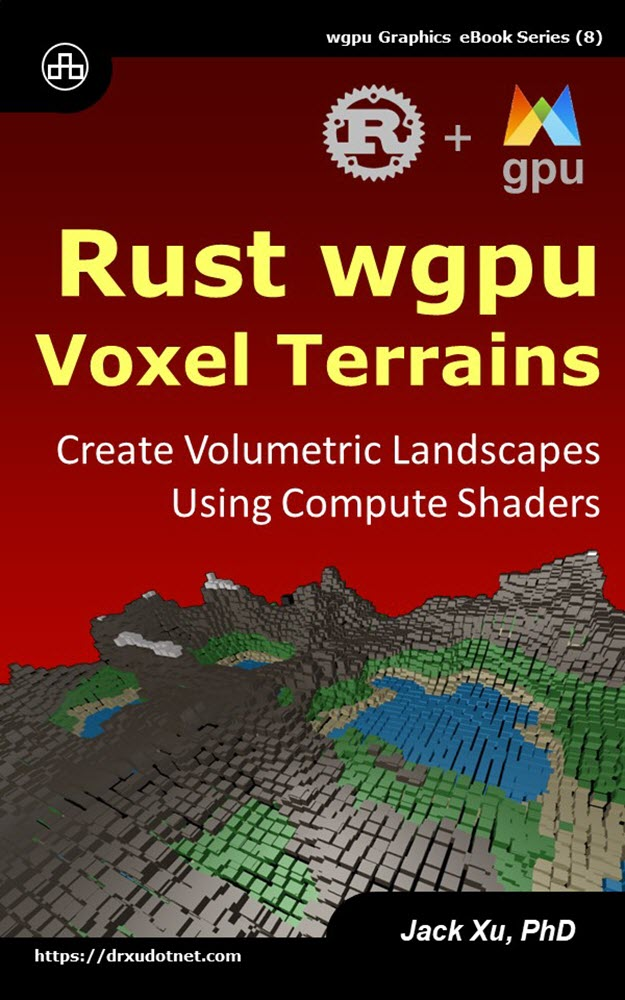

# Rust wgpu Voxel Terrains  
## Create Volumetric Landscapes Using Compute Shaders

This is the source code of example projects contained in the eBook ["Rust wgpu Voxel Terrains"](https://www.amazon.com/exec/obidos/ASIN/B0CLSV3SPT/unicadinccom-20). 

